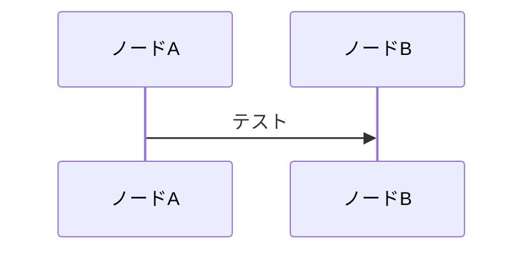

# Foundry tips
## Deployの仕方
```bash
forge script script/DeployFundMe.s.sol
```

## test
```bash
forge test
```
特定の関数のみをテストしたい場合
```bash
forge test --match-test testFunctionName
```
AlchemyなどのNode提供サービスを使って、Deployしたい場合
```bash
forge test --fork-url $SEPOLIA_RPC_URL
```

## Test Coverage
```bash
forge coverage
```
## Gas代を調べる
```bash
forge snapshot --match-test testWithDrawWithASingleFunder
```

以下、Markdownの練習


```LaTeX
7 \equiv 4 \pmod{3}
```
